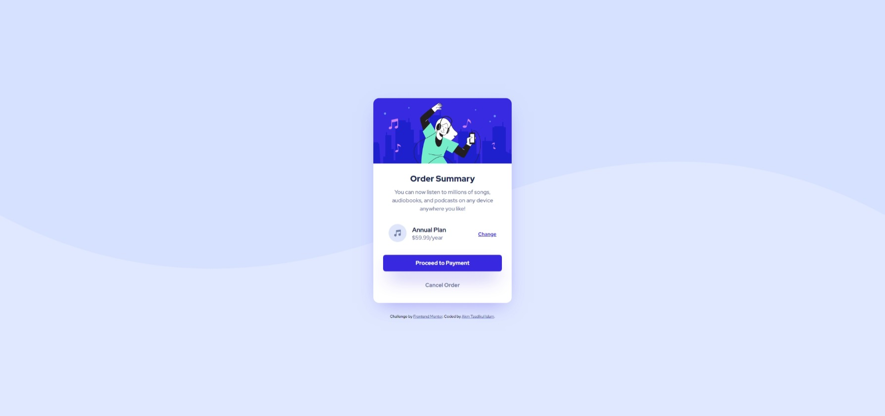
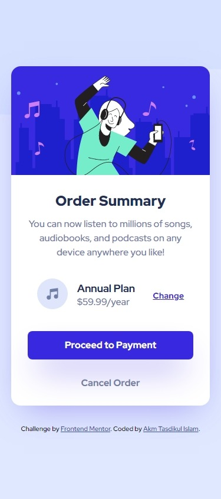
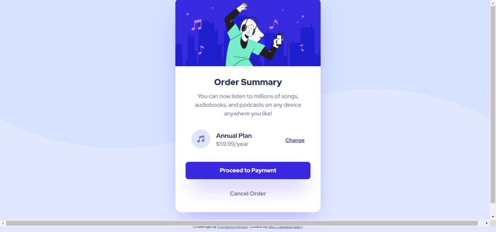

# Frontend Mentor - Order summary card solution

This is a solution to the [Order summary card challenge on Frontend Mentor](https://www.frontendmentor.io/challenges/order-summary-component-QlPmajDUj). Frontend Mentor challenges help you improve your coding skills by building realistic projects.

## Table of contents

- [Overview](#overview)
  - [The challenge](#the-challenge)
  - [Screenshot](#screenshot)
  - [Links](#links)
- [My process](#my-process)
  - [Built with](#built-with)
  - [What I learned](#what-i-learned)
  - [Continued development](#continued-development)
- [Author](#author)

## Overview

A Order Summary Card Component challenge using HTML & CSS for newbies by frontendmentor.io

### The challenge

- The challenge is to build out this order summary card component and get it looking as close to the design as possible.

- Your users should be able to: See hover states for interactive elements

### Screenshot

<style>
  .screenshot-group{
    width:100%
    height:auto;
    display:flex;
    flex-direction:row;
    align-items:flex-end;
    gap:5px;
  }
  #desktop,#mobile{
    display:flex;
    flex-direction:column;
    text-align:center;
  }
  #desktop{
    width:75%;
    height:auto;
  }
  #mobile{
    width:25%;
    height:auto;
  }
</style>

<div class="screenshot-group">

  <div id="desktop">
    
    <p>Desktop View</p>
  </div>

  <div id="mobile">
    
    <p>Mobile View</p>
  </div>

</div>

### Links

- Solution URL: [Solution URL](https://your-solution-url.com)
- Live Site URL: [Live Site URL](https://your-live-site-url.com)

## My process

- First of all I wrote all the necessary markup to fulfill the design requirement
- Then added necessary stylings to match the given design.
- Lastly I've touched the reponsiveness

### Built with

- Semantic HTML5 markup
- CSS custom properties
- Flexbox

### What I learned

- How to use both "background-image" and "background-color" at the sametime

```css
background-color: var(--pale-blue);
background-image: url("./images/pattern-background-desktop.svg");
```

- How to toggle between two background patterns depending on the viewport size using @media query

```css
body {
  background-image: url("./images/pattern-background-desktop.svg");
}

/* Toggeling background image when the maximum viewport width is 357px */
@media screen and (max-width: 375px) {
  body {
    background-image: url("./images/pattern-background-mobile.svg");
  }
}
```

### Continued development

<article>
<p>
I am having issue with responsiveness. My code is working well on all resulotion except 1366×720. My card component is not having any space on top. So, I will look for the solution and revise this project.</p>

</article>

## Author

- Website - [Akm Tasdikul Islam](http://www.tasdikul.rf.gd)
- Frontend Mentor - [@akmtasdikulislam](https://www.frontendmentor.io/profile/akmtasdikulislam)
- Twitter - [@Akm_Tasdikul](https://www.twitter.com/@Akm_Tasdikul)
